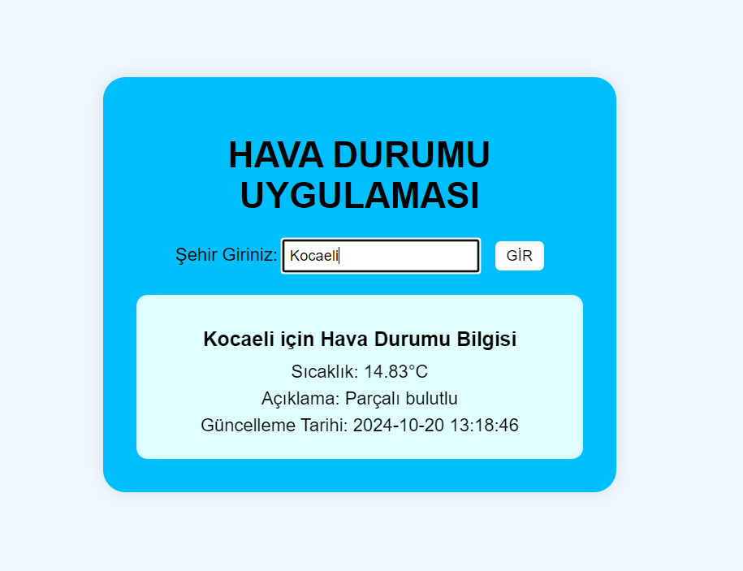

# HAVA DURUMU UYGULAMASI 

* **OpenWeatherMap** web sitesine (https://openweathermap.org) üye olunur ve API anahtarını (API key) alınır.

* Web app için **flask** kullanılmıştır.

Kullanılan kütüphaneler:
- requests: API’den veri çekmek için. 
- pip: Belirli aralıklarla işlemleri otomatikleştirmek için.
- time: Programın bekleme sürelerini yönetmek için.

## ARAYÜZ:

